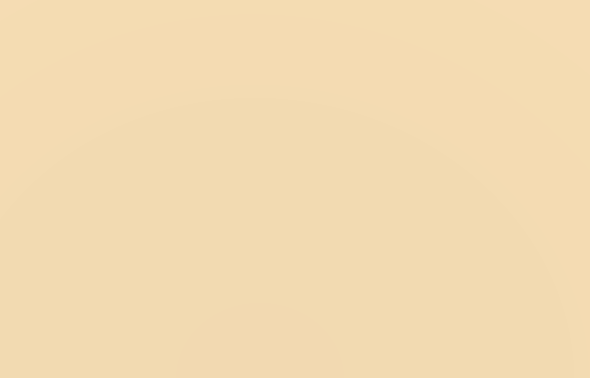

# Curvinator
You can supply a Vector3 arrays (representing the points in a line) to various static classes in the Curvinator namespace.

The Chaikin class uses the chaikin curve algorithm to add multiple points to the array, effectively smoothing the lines they represent.

The CurveMesh class generates a flat mesh based on the supplied points and width.

The LineRendererCurvinator component smooths out the target Line Renderer based on referenced transforms.

Handy for creating roads, rivers, paths etc.

